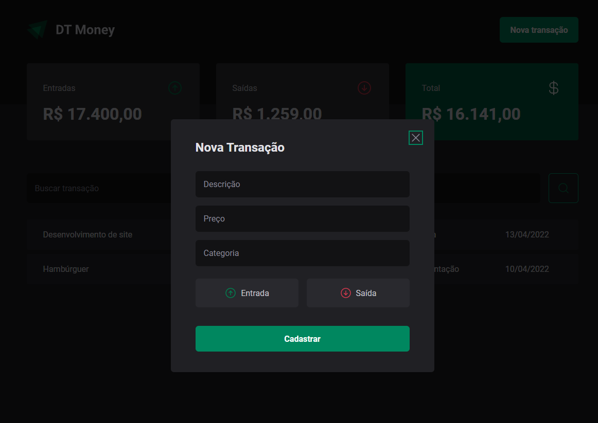

# DT MONEY

## Consumo de API e performance no ReactJS

  Nesse projeto estou construindo uma aplicação front-end web completa, conectando a uma API e aprendo como performar aplicações com o React entendendo como funcionam os algoritmos internos da biblioteca e todo fluxo de renderização de componentes.

  

  

## Dependências

* styled-components
* @types/styled-components -D
* phosphor-react
* radix-ui/react-dialog
* @radix-ui/react-radio-group

## Instale na sua maquina

* git clone https://github.com/Henrique990/dt-money.git
* "npm i" para instalar node_modules
